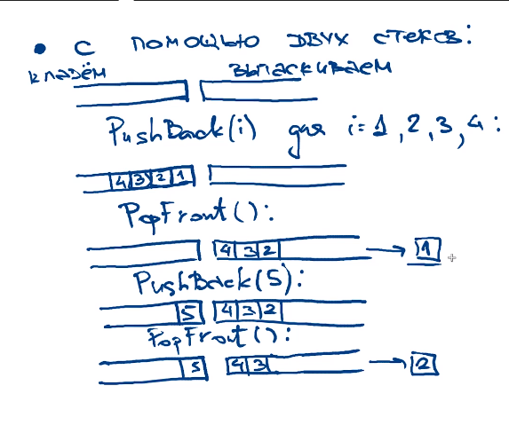
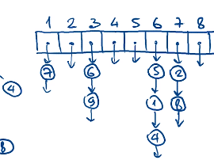
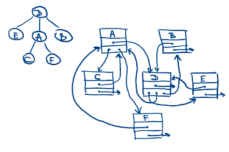
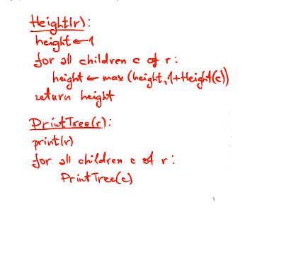
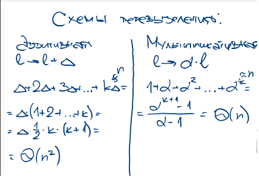

# structures
 Implementation of data structures from the course stepik

Я забыл сохранить часть лекции, и всё удалилиось :(. 

## Л1 Очередь

Реализация очереди с помощью двух стеков. 

Представим, что у нас есть два стека. Один предназначен для команды pushBack, другой для popFront. Первый стек мы будем заполнять до того момента, пока не будет команды popFront. Как только нам поступит данная команда, мы переместим из стека pushBack все числа по правилу извлечения данных в стек popFront. **Недостатком** такой реализации явяляется необходимость перемещение всех данных из первого стека, чтобы получить элемент очереди. Но в среднем время работы O(1), другими же словами – амортизированное время O(1).

**Задача**:

​	Вход: дана последовательность чисел a1, a2, …, an, число m 

​	Выход: пройтись по последовательности окном размера m и вывести минимум в каждом из них. 

**Наивное решение**: O(n*m) 

**Хорошее решение**:O(n+m)

## Л1 Деревья

**Определение**: связный граф без циклов 

**Свойства**: 

1. n вершин, n-1 ребер
2. ровно один путь для любых двух вершин

**Способ представления **:

1. список родителей

   Пусть 1–9 элементы. Тогда для каждого элемента будем хранить его родителя.

2. список детей (список смежностей по сути)

3. вершина хранит данные, ссылку на родителя, ссылку на детей

Алгоритмы как правило рекурсивные. Алгоритм нахождения высоты.

Сначала мы присваеваем высоте единицу, потом мы перебираем всех детей и ищем максимальную высоту среди них.

Печать не буду описывать.

## Л1 Массив переменного размера

Мы хотим иметь константное время доступа к элементу, но не знаем длины нашей последовательности. 

Чтобы решить эту проблему можно сделать так: пока нам хватает места в изначальный массив, добавляем элементы, когда нам перестает хватать места, мы выделяем более большой кусок памяти и уже туда перекопируем данные и добавляем новые. Основной вопрос в том, насколько менять размер массив. Во сколько или на сколько. Мультипликативный – "во сколько раз". Аддитивный способ добавления – "на сколько".  Лучше использовать мультипликативный способ. На картинке ниже видно почему. 

#### Метод потенциалов 

